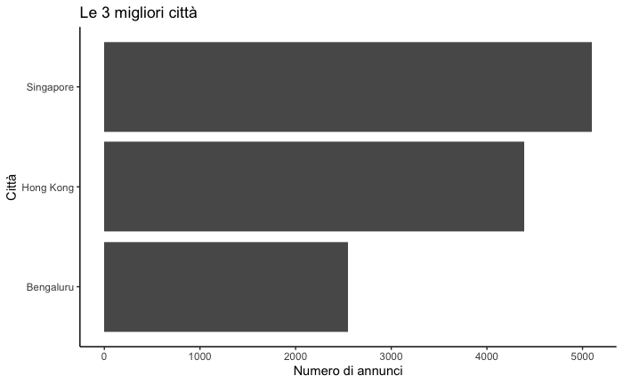
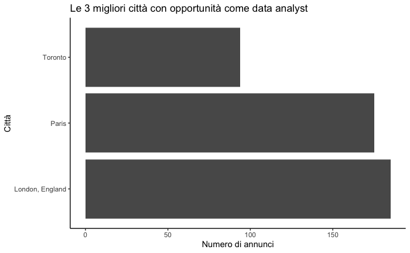
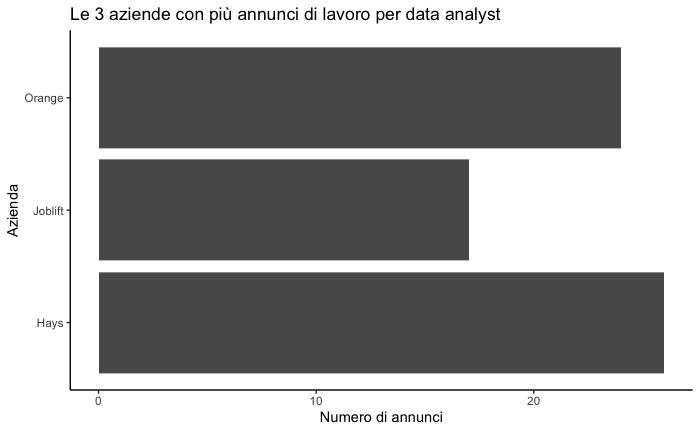
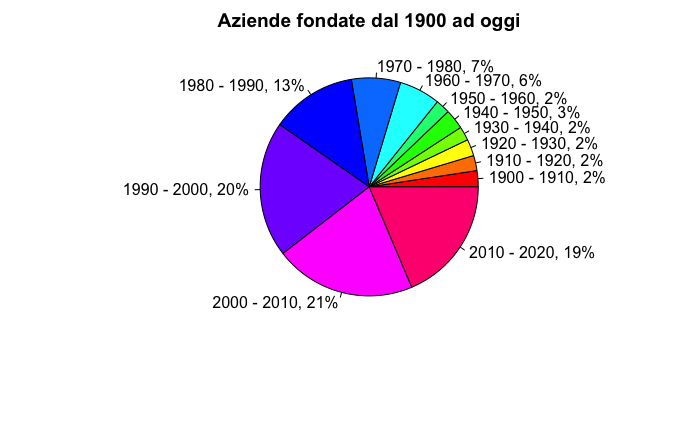
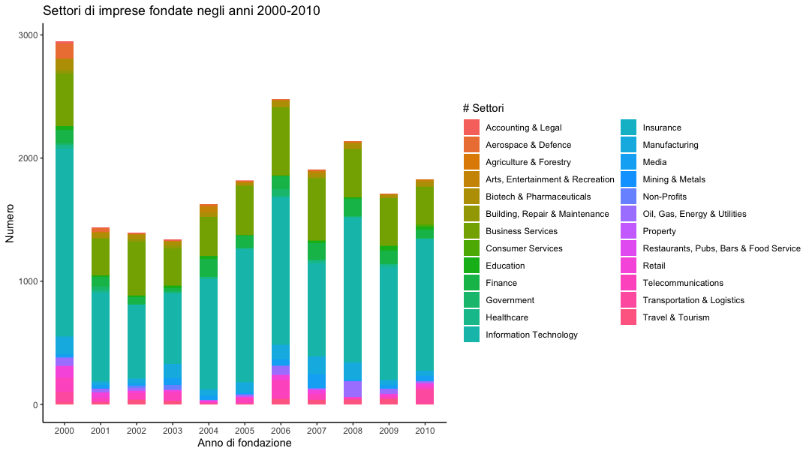

## Introduzione
La vita è breve. 
Spenderemo più della metà della nostra vita a lavorare.
Come voi, anche me questa consapevolezza rende triste, ma proviamo a capire qualcosa di più sul mondo del lavoro, per trarne più vantaggi possibili.

## Dove?
E' importante vivere in un posto che ci piaccia, che ci stimoli, e che non ci faccia attendere tutto l'anno le ferie per andare lontano.

  Se la meta dei vostri sogni è citata nel grafico sovrastante, sono contento per voi. Io lo sono un pò meno.

## Mamma voglio fare il data analyst!
All'affermazione soprastante la mamma mi risponderebbe di prendere un biglietto per Londra (e visti in tempi di farci anche l'assicurazione per il rimborso).

Ma invece a livello mondiale qual'è l'azienda con più opportunità per questa figura?

Ok, dopo andremo a parlare anche di guadagno, teniamo questa informazione per ultima perchè so che è l'unica che vi interessa veramente

## Un analisi generale.
Il 20° secolo e le prime due decadi del 21° secolo hanno visto variare il mondo drasticamente. Vediamo qual'è la decade con più aziende fondate

## 2000 - 2010

